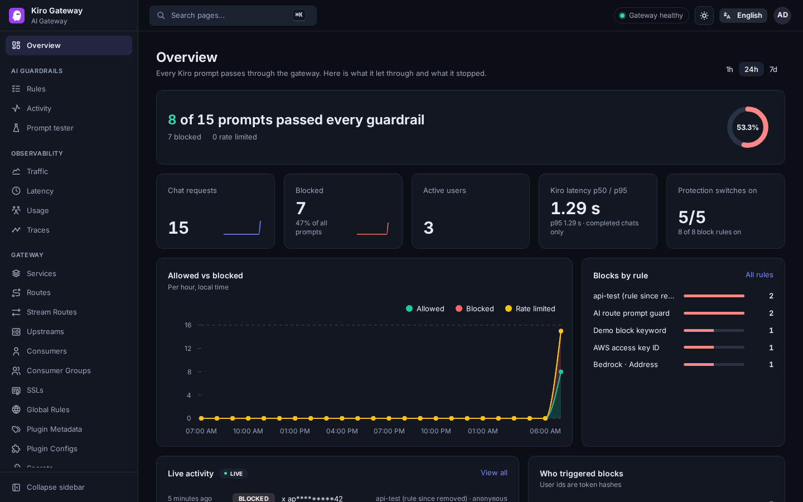

<p align="center"></p>

# Kiro Gateway

Guardrails, audit and monitoring for [Kiro](https://kiro.dev) traffic. Kiro Gateway sits between Kiro
(IDE and CLI) and its service endpoints as an HTTPS proxy, inspects every prompt before it leaves your
network, blocks secrets and personal data, and records who sent what, all managed from one web portal.
It also exposes an OpenAI-compatible AI Gateway route with the same rules.

Runs anywhere Docker Compose runs, or on AWS with one CloudFormation stack.

- **Two guardrail layers**: your regex rules first (instant, offline), then
  [Amazon Bedrock Guardrails](https://aws.amazon.com/bedrock/guardrails/) for personal data and
  denied topics (optional, fail-open by default). Blocked prompts never reach Kiro's backend.
- **Selective interception**: only the Kiro hosts are decrypted; all other HTTPS traffic through the
  proxy is tunnelled untouched.
- **Audit without leaking**: every Kiro request is logged with a per-user key, and every rule match is
  masked before it is written (`AK****OP`), so logs, dashboards and the portal never hold the secret.
- **One portal**: rules editor with history, prompt tester, live activity, traffic, latency, usage and
  traces, plus the full Apache APISIX dashboard, behind one sign-in.
- **Monitoring as code**: Prometheus, Loki, Tempo and Grafana, provisioned with four dashboards.



## How it works

```
Kiro IDE / CLI ──HTTPS_PROXY──▶ Squid :3128 ──Kiro hosts only──▶ APISIX ──TLS──▶ Kiro / AWS endpoints
                                  │                                │
                                  │                                ├─ regex rules ─▶ ml-guard ─▶ Bedrock ApplyGuardrail
                                  │                                └─ audit log ─▶ OTel Collector ─▶ Loki / Tempo
                                  └──all other hosts: CONNECT tunnel, never decrypted──▶ internet

Browser ──HTTPS──▶ Portal (console :9180) ──▶ rules, activity, observability API, APISIX dashboard, Grafana
Apps ──API key──▶ APISIX /v1/chat/completions ──ai-proxy──▶ OpenAI (or the built-in mock LLM)
```

| Component | Role |
|---|---|
| Squid | Thin CONNECT tier. Never decrypts. Sends only the hosts in `squid/hosts` to APISIX; enforces the client allow list. |
| Apache APISIX | Terminates TLS for the Kiro hosts with certificates from the gateway CA, runs the guard (`policy/inference-guard.lua`), rate limits and audit logging, re-encrypts to the real endpoint (upstream certificates verified against pinned Amazon roots). |
| ml-guard | Small service calling Bedrock `ApplyGuardrail` with the user's message only. |
| Console | FastAPI app serving the portal (a fork of the APISIX dashboard, built from `dashboard/patches`), the rules API and a read-only observability API. Holds the APISIX admin key server-side. |
| Monitoring | Prometheus, OpenTelemetry Collector, Loki, Tempo, Grafana. No published ports; Grafana is reached through the portal sign-in. |

Clients need two things: `HTTPS_PROXY` pointing at the gateway, and trust in the gateway CA. Kiro
checks certificates and rejects an unknown CA, so it cannot be intercepted silently. Nothing else on
the client machine changes (`scripts/kiro-via-gateway` sets both for one shell).

## Quick start (Docker Compose)

Requirements: Docker with Compose v2, `openssl`, `jq`, `envsubst` (gettext), `python3`, `git`.

```bash
git clone https://github.com/<owner>/kiro-gateway.git && cd kiro-gateway
scripts/init.sh            # once: .env secrets, CA + certificates, portal sign-in, data/ (idempotent)
docker compose up -d       # builds the console (incl. the portal) and ml-guard images on first run
scripts/apply.sh           # pushes routes, policy and certificates to APISIX
```

- Portal: [https://127.0.0.1:9180/](https://127.0.0.1:9180/), user `admin`, password in
  `pki/console-initial-password`. The certificate is issued by the gateway CA (`pki/ca.crt`).
- Use Kiro through the gateway:

  ```bash
  source scripts/kiro-via-gateway on     # this shell only; refuses if the proxy is down
  kiro-cli chat
  source scripts/kiro-via-gateway off    # previous environment restored
  scripts/kiro-via-gateway run kiro-cli chat --no-interactive "hello"   # one command
  ```

- Check everything end to end: `scripts/verify.sh`.

Everything binds to `127.0.0.1` by default. To serve other machines, set `KGW_BIND_ADDR`,
`KGW_PROXY_BIND_ADDR`, `CONSOLE_ALLOW_CIDRS`, `KGW_PROXY_ALLOW_CIDRS` and `KGW_PUBLIC_NAMES` in
`.env`, re-run `scripts/init.sh`, then `docker compose up -d` (see [Configuration](#configuration)).

To turn on the Bedrock layer, create a guardrail (definition in
`docs/evaluation/bedrock-guardrail.json`, or let the AWS stack create one), set
`BEDROCK_GUARDRAIL_ID` / `BEDROCK_GUARDRAIL_VERSION` in `.env`, give the host AWS credentials allowed
to call `bedrock:ApplyGuardrail`, run `docker compose up -d ml-guard`, and switch
**Bedrock Guardrails** on in the portal's Rules page.

## Deploy to AWS

`deploy/` is a CDK app (TypeScript) that also synthesizes to a plain CloudFormation template.

```
Browser ─HTTPS─▶ CloudFront + AWS WAF ─VPC origin─▶ internal ALB ─HTTPS─▶ ┐
Kiro clients (in the VPC / peered) ─▶ internal NLB :3128 ───────────────▶ ├ gateway instance (private subnet)
                                                                          ┘   └─ encrypted data volume, daily snapshots
```

What the stack creates:

- **Gateway**: one Amazon Linux 2023 instance in a private subnet, in an Auto Scaling group of one (a
  failed instance is replaced and re-attaches the data volume: same CA, rules and history). IMDSv2,
  encrypted disks, no SSH key: use Session Manager.
- **State**: an encrypted gp3 data volume holding `.env`, `pki/`, `data/` and all Docker volumes, with
  daily snapshots (Data Lifecycle Manager) and a final snapshot on delete.
- **Portal**: CloudFront (HTTPS on its `*.cloudfront.net` name, so no domain or certificate is needed)
  with AWS WAF (per-IP rate limits, a strict limit on `/api/login`, AWS IP reputation, known bad inputs
  and the common rule set) in front of an internal Application Load Balancer, reached through a
  CloudFront VPC origin. The load balancer accepts connections only from CloudFront's origin-facing
  addresses and forwards only requests that carry CloudFront's secret origin header. There is no IP allow list: access is
  WAF + the portal sign-in.
- **Proxy**: an internal Network Load Balancer on port 3128 for Kiro clients, limited to `ProxyAllowedCidr`.
- **Bedrock**: a guardrail and version created by the stack (`deploy/lib/guardrail-policy.ts`); the
  instance role may only apply that guardrail.
- **Secrets**: the portal sign-in (generated, Secrets Manager), a backup of the gateway CA, the origin
  secret. The public CA certificate is published as an SSM parameter for clients.
- **Operations**: container logs in CloudWatch Logs, alarms on unhealthy targets, Auto Scaling
  notifications to an SNS topic (optional e-mail). cdk-nag (AWS Solutions) clean; every exception
  carries its reason in `deploy/lib/gateway-stack.ts`.

### Option A: CloudFormation template (Launch Stack)

Each release attaches `kiro-gateway.template.json` (new VPC) and `kiro-gateway-existing-vpc.template.json`
to the GitHub release. CloudFormation reads templates from S3, so upload one to a bucket you own and
open the console with it, or use the CLI:

```bash
aws s3 cp kiro-gateway.template.json s3://<bucket>/kiro-gateway.template.json
# Launch Stack link (us-east-1):
# https://console.aws.amazon.com/cloudformation/home?region=us-east-1#/stacks/create/review?stackName=KiroGateway&templateURL=https://<bucket>.s3.amazonaws.com/kiro-gateway.template.json

aws cloudformation deploy --region us-east-1 --stack-name KiroGateway \
  --template-file kiro-gateway.template.json --capabilities CAPABILITY_IAM \
  --parameter-overrides ProxyAllowedCidr=10.40.0.0/16
```

The template has no CDK assets and needs no `cdk bootstrap`. The instance clones `SourceRepoUrl` at
`SourceRef` (set to the release tag) and builds the images on first boot (about 10 minutes; the stack
waits for the instance to report success).

### Option B: CDK

```bash
cd deploy && npm ci
npx cdk deploy KiroGateway --parameters ProxyAllowedCidr=10.40.0.0/16 \
  -c repoUrl=https://github.com/<owner>/kiro-gateway.git -c repoRef=v1.0.0
# Deploy this working copy instead of a git ref (needs `cdk bootstrap` once per account/region):
npx cdk deploy KiroGateway -c source=asset --parameters ProxyAllowedCidr=10.40.0.0/16
```

`KiroGatewayExistingVpc` deploys into your VPC instead (two private subnets with NAT in different AZs).

### After the deploy

```bash
# Portal URL and sign-in
aws cloudformation describe-stacks --stack-name KiroGateway --query 'Stacks[0].Outputs' --output table
aws secretsmanager get-secret-value --secret-id <PortalLoginSecret> --query SecretString --output text
# CA certificate for Kiro clients (install as trusted, or point SSL_CERT_FILE at a bundle that includes it)
aws ssm get-parameter --name <CaCertificateParameter> --query Parameter.Value --output text > kiro-gateway-ca.crt
```

Clients then use `HTTPS_PROXY=<ProxyEndpoint>`. Shell access: `aws ssm start-session --target <instance-id>`.

Rough cost in us-east-1 with the defaults: about **US$165 per month** (t3.large ~$61, NAT gateway ~$33,
two load balancers ~$35, WAF ~$10, public IPv4 ~$7, storage and snapshots ~$10, the rest a few dollars;
Bedrock is per use, about US$0.25 per 1,000 short prompts). Use the
[AWS Pricing Calculator](https://calculator.aws/) for your own numbers. Delete with
`npx cdk destroy KiroGateway` or by deleting the stack; the final snapshot and the log group are kept.

## Portal

| Page | What it does |
|---|---|
| Overview | Allowed vs blocked, blocks by rule, active users, Kiro latency, protection switches. |
| Rules | Block rules (PCRE, per path: Kiro and/or the AI route), protection switches and limits, the Bedrock layer (on/off, timeout, fail mode), the block message. **Save & apply** validates, applies to the live gateway and commits to the rule history. |
| Activity | Live audit log with search and filters; prompts are shown masked. |
| Prompt tester | Runs text through both layers without sending it anywhere else. |
| Traffic, Latency, Usage, Traces | Fixed server-side Prometheus / Loki / Tempo queries; each card links to Grafana. |
| Gateway | The stock APISIX dashboard pages (routes, upstreams, consumers, SSL, plugins), using the server-side admin key. |

Security model: [docs/security.md](docs/security.md).

## Configuration

`.env` (created by `scripts/init.sh` from `.env.example`, mode 0600, git-ignored):

| Setting | Default | Meaning |
|---|---|---|
| `APISIX_ADMIN_KEY`, `AI_GW_DEMO_KEY`, `AI_GW_MOCK_TOKEN` | generated | Admin API key, demo consumer key for the AI route, mock LLM token. |
| `CONSOLE_USER`, `CONSOLE_PASSWORD_HASH` | generated | Portal sign-in (scrypt hash). Change with `scripts/console-passwd.sh <user> --stdin`. |
| `KGW_BIND_ADDR`, `KGW_PORT` | `127.0.0.1`, `9180` | Where the portal listens. |
| `KGW_PROXY_BIND_ADDR` | `127.0.0.1` | Where Squid's :3128 listens. |
| `CONSOLE_ALLOW_CIDRS` | `127.0.0.0/8,172.30.0.1/32` | Networks allowed to use the portal (keep the defaults; they are the host's own scripts). |
| `CONSOLE_TRUSTED_PROXY_CIDRS` | empty | Only behind CloudFront: networks whose `CloudFront-Viewer-Address` header is trusted. |
| `KGW_PROXY_ALLOW_CIDRS` | empty (this host only) | Networks allowed to use the proxy. |
| `KGW_PUBLIC_NAMES` | empty | Extra DNS names / IPs for the portal certificate. |
| `BEDROCK_GUARDRAIL_ID`, `BEDROCK_GUARDRAIL_VERSION`, `AWS_REGION` | empty, `1`, `us-east-1` | Bedrock layer. Empty ID = the layer reports unavailable and the fail mode applies. |
| `PROMPT_LOG` | `masked` | `masked`: prompts stored with rule matches masked. `off`: no prompt text stored. |
| `OPENAI_API_KEY` | unset | Use OpenAI instead of the mock LLM on the AI route (`scripts/apply.sh` after setting). |
| `KGW_CONSOLE_IMAGE`, `KGW_ML_GUARD_IMAGE` | local builds | Use released images, e.g. `ghcr.io/<owner>/kiro-gateway-console:1.0.0`, then `docker compose pull`. |

Rules start from `config/guardrails.default.json` and live in `data/guardrails.json` (its own git
history, written by the portal). Intercepted hosts: `squid/hosts`, with matching `config/routes` and
`config/upstreams` (`scripts/intercept-host.sh <host>` adds one). The defaults cover kiro-cli's
`us-east-1` endpoints; re-check after Kiro upgrades.

AWS stack parameters: `ProxyAllowedCidr`, `CloudFrontWebAclArn` (only outside us-east-1, see the
parameter description), `InstanceType`, `DataVolumeSize`, `SnapshotRetentionDays`, `AlarmEmail`,
`SourceRepoUrl`, `SourceRef`, and for the existing-VPC stack `VpcId`, `AvailabilityZone`, `PrivateSubnetId`,
`PrivateSubnet2Id`. Supported regions: us-east-1, us-east-2, us-west-2, eu-central-1, eu-west-1,
eu-west-3, ap-northeast-1, ap-south-1, ap-southeast-1, ap-southeast-2.

## Guardrail effectiveness

Measured on `docs/evaluation/testset.jsonl` (48 fake Thai and English prompts: 23 should be blocked, 25
should pass):

| Layers | Precision | Recall | False blocks | Misses |
|---|---|---|---|---|
| Regex rules alone | 0.89 | 0.35 | 1 | 15 |
| Regex + Bedrock (PII + data-exfiltration topic) | **0.95** | **0.87** | 1 | 3 |

The false block is a 16-digit build number read as a card number; the three misses are prompt-injection
attempts. Bedrock's prompt-attack filter is deliberately off: at every strength it blocked ordinary
coding-assistant prompts. Bedrock adds about 0.5 s per Kiro chat (p50 450-500 ms). Details, the
guardrail definition and the Strands Decider evaluation (not used: too slow on CPU) are in
[docs/evaluation](docs/evaluation).

## Tests

| Command | Checks |
|---|---|
| `scripts/verify.sh` | Stack, interception, non-Kiro tunnelling, blocks, Bedrock layer, AI route, real `kiro-cli` on/off. |
| `console/tests/api_test.sh` | Portal API: sign-in, CSRF, rule edit/apply/history, tester, observability API. |
| `python3 monitoring/tests/monitoring_check.py` | Fresh tagged traffic arrives in Prometheus, Loki, Tempo and every Grafana panel. |
| `NODE_PATH=$(npm root -g) OUT=<dir> node console/tests/portal_e2e.js` | Browser run (Playwright): add a rule, real kiro-cli blocked, pages, remove the rule. |
| `scripts/dashboard.sh check` | Portal lint, type check and unit tests (in Docker). |
| `cd deploy && npm test` | CloudFormation template properties (network exposure, IAM, encryption, WAF). |

CI (`.github/workflows/ci.yml`) runs the linters, gitleaks over the full history, the portal checks,
image builds with a Trivy scan, the template tests with cdk-nag and cfn-lint, and a full-stack smoke
test. Tagging `v*.*.*` publishes multi-arch images to GHCR with SBOM and provenance
(`.github/workflows/release.yml`).

## Repository layout

```
config/       APISIX objects (routes, upstreams, plugin metadata) and the default rules
policy/       the Kiro guard (Lua)
scripts/      init, apply, build-policy, certificates, kiro-via-gateway, verify
squid/        proxy configuration and the intercepted host list
console/      portal backend (FastAPI), sign-in page, tests
dashboard/    the portal UI: pinned upstream APISIX dashboard + our patch series (scripts/dashboard.sh)
ml-guard/     Bedrock Guardrails layer
monitoring/   Prometheus, OTel Collector, Loki, Tempo, Grafana (dashboards as code), monitoring test
deploy/       AWS CDK app and instance bootstrap
docs/         runbook, security notes, rollout guide, guardrail evaluation, design notes
```

## Limits

- **Identity**: Kiro traffic is attributed to a hash of the user's bearer token, which changes when the
  token refreshes. Per-user identity needs a real identity source (see [docs/rollout.md](docs/rollout.md)).
- **What is inspected**: the current prompt of each Kiro chat request (including context Kiro adds).
  History is not re-scanned and model responses are not inspected. Requests whose body cannot be read
  are blocked (`uninspectable`).
- **Bypass**: users who unset `HTTPS_PROXY` reach Kiro directly unless egress to the Kiro hosts is
  limited to the gateway (firewall / security groups).
- **Evasion**: the guard normalises full-width characters, Thai digits and zero-width characters
  before matching. Spelled-out or split secrets are not caught by regex; the Bedrock layer catches some.
- **Region and version**: intercepted hosts are the `us-east-1` endpoints observed with kiro-cli 2.27.
  Whether Kiro also honours the OS trust store (as well as `SSL_CERT_FILE`) is not yet verified.

Operations: [docs/runbook.md](docs/runbook.md). Org-wide rollout: [docs/rollout.md](docs/rollout.md).

## License and trademarks

Apache License 2.0 ([LICENSE](LICENSE)). The portal is a modified version of
[Apache APISIX Dashboard](https://github.com/apache/apisix-dashboard) (Apache-2.0); see [NOTICE](NOTICE).

Kiro Gateway is an independent project, not affiliated with or endorsed by Amazon Web Services or the
Kiro team. Kiro, AWS and Amazon Bedrock are trademarks of Amazon.com, Inc. or its affiliates; the Kiro
logo (from [thesvg.org](https://thesvg.org/icons/kiro)) is used only to identify the product this
gateway works with. Replace it if you publish a fork under your own brand.
